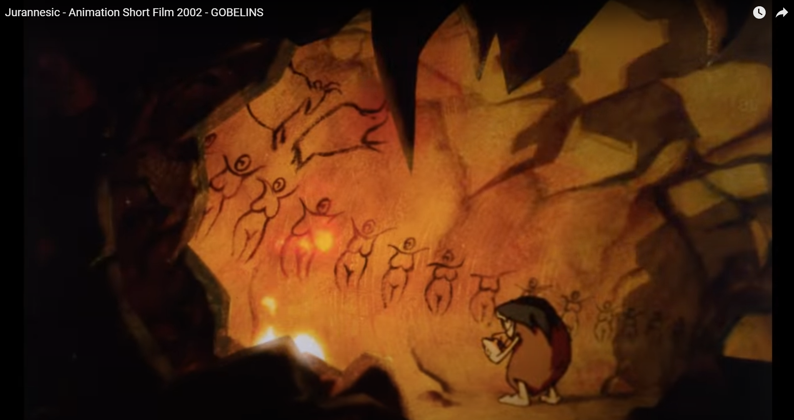

# Gobelins 2002 - Jurannessic

"Gobelins 2002 - Jurannessic" é um curta-metragem de animação produzido pelos estudantes da escola de animação Gobelins. Lançado em 2002, este curta-metragem oferece uma visão envolvente e imaginativa do período jurássico.

## Sinopse

Em um mundo habitado por dinossauros, um grupo deles se vê diante da descoberta de uma pedra misteriosa que emite luz. Essa descoberta desencadeia uma série de eventos que desafiam as normas e a ordem estabelecida entre as diferentes espécies de dinossauros.

## Características Principais

- **Narrativa Visual**: A história é contada principalmente através de expressões faciais, gestos e movimentos dos personagens, sem o uso de diálogos.
- **Animação Deslumbrante**: Os cenários são ricamente detalhados, e os dinossauros são habilmente animados, dando-lhes uma sensação de vida e personalidade.
- **Direção de Arte Imaginativa**: A paleta de cores vibrantes e a direção de arte contribuem para criar um mundo que é ao mesmo tempo familiar e misterioso.
- **Trilha Sonora Envolvente**: A música complementa perfeitamente a ação na tela, adicionando uma camada adicional de emoção e energia à história.

## Como Assistir

Você pode assistir a "Gobelins 2002 - Jurannessic" no [YouTube](link_para_o_video_do_curta) ou no [site oficial da Gobelins](link_para_o_site_oficial), onde ele pode estar disponível para visualização.

## Contribuições

Este é apenas um exemplo de um README.md. Se você deseja contribuir para este projeto, sinta-se à vontade para adicionar mais informações, como links para recursos adicionais, análises críticas ou informações sobre os criadores do curta-metragem.

## Licença

Este projeto é licenciado sob [Licença MIT](LICENSE).

